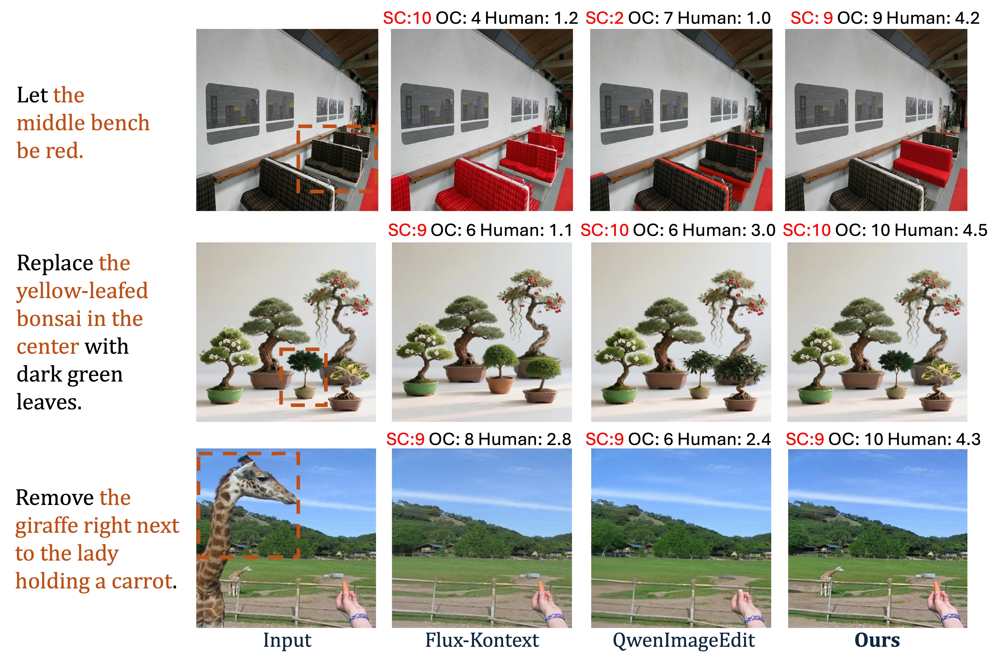

# Visualizing the Necessity of OC

**Figure 1:** *Qualitative examples illustrating the limitations of SC and the effectiveness of OC. As shown, baseline methods can achieve competitive SC scores but often fail to preserve non-target regions, such as altering all benches (Row 1), changing background bonsai quantities (Row 2), or distorting background terrain (Row 3). This results in low OC and low human scores. In contrast, our method successfully limits edits exclusively to the target region, achieving high OC and aligning perfectly with human preference.*
